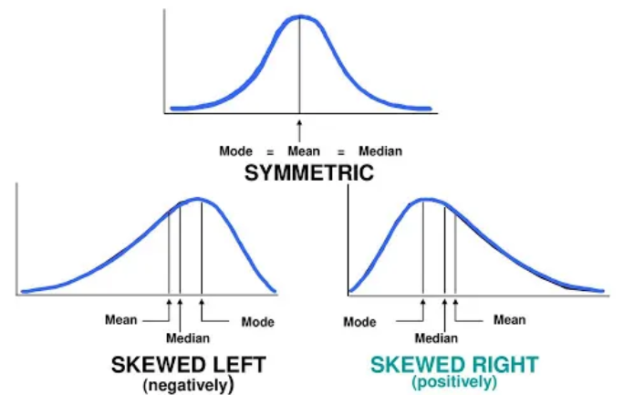

# 📘 Hypothesis Testing and T-Test

---

## 1️⃣ Measures of Central Tendency  

These describe the **center** of a dataset.

### Mean (Average)  
Mean = (Sum of all values) / Number of values  

Example:  
60, 70, 80  
Mean = (60 + 70 + 80) / 3 = 70  

### Median  
The middle value when data is ordered.  
60, 70, 80 → Median = 70  

### Mode  
The most frequent value.  
60, 70, 70, 80 → Mode = 70  

---

## 2️⃣ Skewness (Shape of Data)

Skewness describes the **shape** of a dataset and how values are distributed around the mean.

It tells us whether the data is:
- Balanced  
- Pulled to the right  
- Pulled to the left  

Understanding skewness helps us interpret averages and choose the correct statistical test.

### 🔹 Symmetric Distribution  
- Mean = Median = Mode  
- Balanced shape  
- No skew  

### 🔹 Positively Skewed (Right-Skewed)  
- Mean > Median > Mode  
- Large values pull the mean to the right  

### 🔹 Negatively Skewed (Left-Skewed)  
- Mean < Median < Mode  
- Small values pull the mean to the left  

---

## 3️⃣ Normal Distribution  

A **bell-shaped curve** where:  
Mean = Median = Mode  

### 68–95–99.7 Rule

| Range | % of Data |
|-------|-----------|
| μ ± 1σ | 68% |
| μ ± 2σ | 95% |
| μ ± 3σ | 99.7% |

Example:  
If mean = 70 and SD = 10  
68% of scores are between 60 and 80  

---

## 4️⃣ What is a Hypothesis?

A hypothesis is a **statement about a population**.

Example:  
"The average score is 70."

---

## 5️⃣ Hypothesis Testing Steps

1. State H₀ and H₁  
2. Choose the test  
3. Calculate the statistic  
4. Find the p-value  
5. Make a conclusion  

---

## 6️⃣ Null Hypothesis (H₀)

H₀ represents **no change or no effect**.

Example:  
H₀: μ = 70  

---

## 7️⃣ Alternative Hypothesis (H₁)

| Type | Meaning |
|------|---------|
| μ ≠ 70 | Two-tailed |
| μ > 70 | Right-tailed |
| μ < 70 | Left-tailed |

---

## 8️⃣ Significance Level and Confidence Level

### Formula  
C + α = 1  

Where:  
- α = Significance Level  
- C = Confidence Level  

---

### 8.1 Significance Level (α)

The significance level is the **risk of rejecting a true null hypothesis**.

| α | Meaning |
|----|--------|
| 0.05 | 5% risk |
| 0.01 | 1% risk |

---

### 8.2 Confidence Level (C)

The confidence level shows how **sure** we are about our result.

| C | Meaning |
|----|--------|
| 0.95 | 95% confident |
| 0.99 | 99% confident |

---

### 8.3 Why C + α = 1?

Example:  
α = 0.05  
C = 0.95  

0.95 + 0.05 = 1  

This means:  
95% confidence, 5% risk of error.

---

## 9️⃣ Z-Score  

A Z-score measures how far a value is from the mean in **standard deviations**.

Formula:  
Z = (X − μ) / σ  

Example:  
Score = 80  
Mean = 70  
SD = 5  

Z = (80 − 70) / 5 = 2  

Meaning:  
The score is **2 SD above the mean**.

---

## 🔟 Z-Table (Standard Normal Table)

A Z-table shows the **area to the left** of a Z-score.

| Z-value | Meaning | Area to the Left |
|--------|---------|------------------|
| 0.00 | At the mean | 0.5000 |
| 1.00 | 1 SD above | 0.8413 |
| 1.64 | Top 5% | 0.9500 |
| 1.96 | Top 2.5% | 0.9750 |
| 2.33 | Top 1% | 0.9900 |

How to read:  
1. Row = first two digits  
2. Column = decimal  
3. Cell = probability to the left  

Example:  
Z = 1.23 → Area ≈ 0.8907  

---
## 1️⃣2️⃣ Calculated Z, Critical Z, and P-Value

These three values are used in **hypothesis testing** to decide whether to reject the null hypothesis (H₀).

### 12.1 Calculated Z (Test Statistic)

The **calculated Z** is computed from your sample data.

It tells you how far your sample result is from the hypothesized mean in **standard deviation units**.

Formula:

Z = (x̄ − μ) / (σ / √n)

Where:  
x̄ = sample mean  
μ = population mean  
σ = population standard deviation  
n = sample size  

Example:

x̄ = 95  
μ = 100  
σ = 10  
n = 25  

Z = (95 − 100) / (10 / √25)  
Z = −5 / 2  
Z = −2.5  

Meaning:  
The sample mean is **2.5 standard deviations below** the population mean.

---

### 12.2 Critical Z (Cutoff Value)

The **critical Z** is the **boundary value** that decides whether a result is extreme enough to reject H₀.

It depends on:  
• Significance level (α)  
• Type of test (one-tailed or two-tailed)  

Common Critical Z Values:

| α | Test Type | Critical Z |
|---|----------|------------|
| 0.05 | Two-tailed | ±1.96 |
| 0.05 | One-tailed | 1.645 |
| 0.01 | Two-tailed | ±2.33 |

Decision Rule:

If  
|Calculated Z| > Critical Z  

→ Reject H₀  

Example:

Calculated Z = −2.5  
Critical Z = ±1.96  

Since |−2.5| > 1.96  

→ Reject H₀  

---

### 12.3 P-Value

The **p-value** shows how likely your result is **if H₀ is true**.

It measures the **strength of evidence** against H₀.

Decision Rule:

| Condition | Decision |
|----------|----------|
| p ≤ α | Reject H₀ |
| p > α | Do not reject H₀ |

Example:

Z = −2.5  
p ≈ 0.012  

Since:  
0.012 < 0.05  

→ Reject H₀  

---

### 12.4 Final Comparison

| Term | Comes From | Purpose |
|------|------------|---------|
| Calculated Z | Sample data | Measures how extreme the result is |
| Critical Z | Z-table | Sets the rejection boundary |
| P-value | Z-score | Measures evidence strength |

---

### 12.5 One-Line Summary

• **Calculated Z** = What your data says  
• **Critical Z** = How extreme is “too extreme”  
• **P-value** = How strong the evidence is  

---

---
